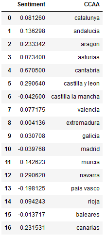

# SDPrac2

Practica 2 de Sistemas Distribuidos: Sentiment Analysis PAU/EvAU Comunidades

Ismael y Gabriel

```Las librerías necesarias se pueden instalar mediante: pip install -r requirements.txt```

## Ejecución

Para hacer funcionar este proyecto es necesario definir un fichero ".lithops_config" con las API key del servicio Object Storage y Serverless Functions correspondiente.
Más información acerca de lithops [aqui](https://github.com/lithops-cloud/lithops).

La API Key de Twitter se define en las constantes al inicio de [Twitter_Analyzer.py](https://github.com/IsmaelHG/SDPrac2/blob/main/Twitter_Analyzer.py#L14)

Se ha utilizado un custom runtime de lithops ```ismaelhg2000/sdprac2runtime:1.0``` basado en el [Dockerfile](Dockerfile).

Él [Notebook](Notebook_Stage3.ipynb) incluye el codigo necesario para ejecutar las tres etapas del proyecto.

## Plot

Resultado actual (18/06/2021)





Sistemes distribuits URV (2020-2021)